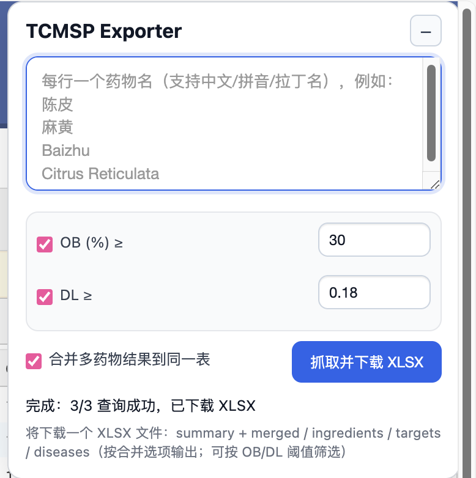

# TCMSP-Exporter

## ⚠️ 重要说明（请先阅读）
**本项目是旧项目 `TCMSP-Spider` 的新版替代实现。** 新版不再依赖本地 Python 环境，改为浏览器内运行的 Tampermonkey 油猴脚本，适配 TCMSP 当前页面结构与接口变化。

- 旧项目仓库：[TCMSP-Spider](https://github.com/shujuecn/TCMSP-Spider)
- 新项目仓库：[TCMSP-Exporter](https://github.com/shujuecn/TCMSP-Exporter)

---

## 项目简介
`TCMSP-Exporter` 是一个运行在浏览器中的 TCMSP 数据导出工具。

在 TCMSP 页面输入药物名（支持批量，每行一个）后，可自动抓取：

- Ingredients（成分）
- Related Targets（相关靶点）
- Related Diseases（相关疾病）

并导出为一个 `.xlsx` 文件（多工作表）。

## 功能特性
- 浏览器内运行：无需 Python、无需手动维护 token
- 批量查询：支持多药物同时抓取（每行一个）
- 合并导出：可选将多药物结果合并到同一表格，并附带标识列
- 成分筛选：悬浮窗支持可勾选阈值筛选，默认 `OB (%) >= 30`、`DL >= 0.18`，且阈值可自定义
- 多表导出：`summary` + `merged/ingredients/targets/diseases`
- 悬浮窗交互：支持拖动、折叠/展开，状态自动记忆

## 文件说明
- `tcmsp-exporter.user.js`：油猴脚本主文件（可直接导入 Tampermonkey）

## 使用方法
### 1. 安装 Tampermonkey
请先在浏览器安装 [Tampermonkey](https://www.tampermonkey.net/) 扩展。

### 2. 导入脚本

- 访问 [TCMSP Exporter]( https://greasyfork.org/zh-CN/scripts/567363-tcmsp-exporter) 安装**（推荐）**。

- 或将仓库中的 `tcmsp-exporter.user.js` 导入 Tampermonkey 并启用。

### 3. 打开 TCMSP 页面
访问：[https://www.tcmsp-e.com/tcmspsearch.php](https://www.tcmsp-e.com/tcmspsearch.php)
页面右侧会出现悬浮面板。

### 4. 输入查询词并下载
1. 在输入框中按“每行一个”输入药物名（中文/拼音/拉丁名均可）
2. 按需勾选并调整筛选条件（`OB (%)`、`DL` 阈值）
3. 按需勾选“合并多药物结果到同一表”
4. 点击“抓取并下载 XLSX”
5. 等待抓取完成，浏览器自动下载 Excel 文件

## 导出结果说明
导出的 `.xlsx` 至少包含以下工作表：

- `summary`：每个查询词的命中状态与行数统计
- `merged_all` 或 `q*_merged`：合并结果
- `ingredients_all` 或 `q*_ingredients`：成分数据
- `targets_all` 或 `q*_targets`：靶点数据
- `diseases_all` 或 `q*_diseases`：疾病数据

当启用“合并”时，会添加标识列（如 `query_keyword`、`query_index`、`herb_*`）用于区分来源。

## 兼容与注意事项
- 仅适用于 TCMSP 网站当前结构；若网站前端改版，需同步更新脚本
- 首次运行或网络较慢时，抓取时间会增加
- 若提示未命中，请检查药物名拼写，或尝试中文/拼音/拉丁名的另一种写法

## License
MIT

## Demo

